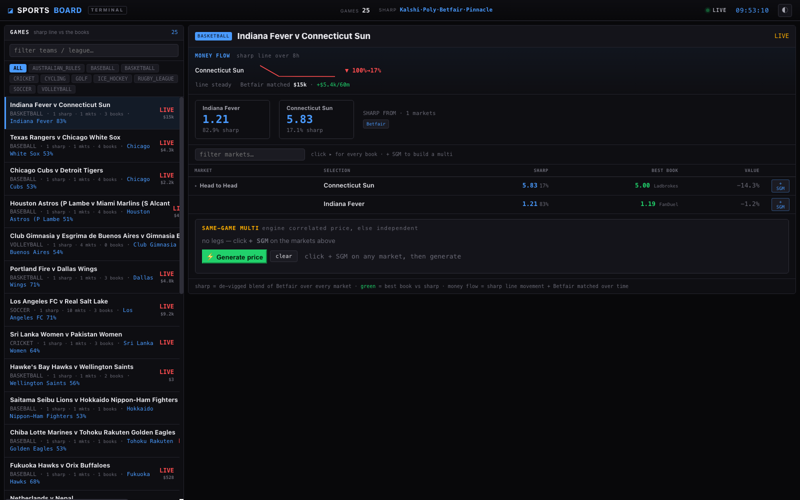
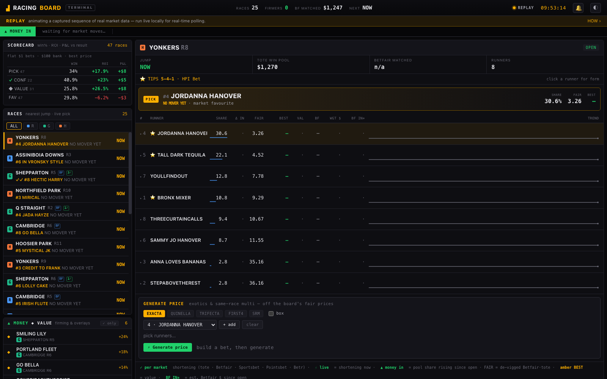

# sportsdata-mcp

[](https://github.com/DanielTomaro13/sportsdata-mcp/actions/workflows/ci.yml)
[](https://github.com/DanielTomaro13/sportsdata-mcp/releases/latest)
[](./LICENSE)
[](https://glama.ai/mcp/servers/DanielTomaro13/sportsdata-mcp)

[](https://cursor.com/en/install-mcp?name=sportsdata&config=eyJjb21tYW5kIjogInV2eCIsICJhcmdzIjogWyJzcG9ydHNkYXRhLW1jcCIsICJzZXJ2ZSJdfQ==)

**Ask your AI which bookmaker is paying more — and get a real answer.**

Free & open source (MIT). ~738 tools across 60 providers in Claude Desktop,
Cursor, or any MCP client. `uvx sportsdata-mcp serve` and you're done.

> **You:** Which book has the best price on Parramatta v Penrith, and how big is the spread?

Claude queries five books at once and comes back with:

| Book | Eels | Panthers |
|-----------|------:|---------:|
| Betfair | 1.18 | **6.20** |
| BetR | 1.17 | 5.00 |
| PointsBet | 1.17 | 4.80 |
| Pinnacle | 1.17 | 4.78 |
| Sportsbet | **1.19** | 4.75 |

*Real captured odds. The same bet on Penrith pays **$6.20** at Betfair and
**$4.75** at Sportsbet — a **30% spread** on identical risk. That gap is
invisible unless something is reading every book at once.*

**What this one is for: comparing prices, not just fetching scores.** Plenty of
sports MCP servers will get you fixtures and standings. This one is built around
*disagreement between books* — eleven bookmakers, the Betfair exchange, and two
prediction markets (Kalshi, Polymarket) side by side on the same market, plus
twenty-seven official league/stats feeds. Deep on AU/NZ books (Sportsbet, TAB,
Ladbrokes, PointsBet, BetR, Dabble) and on racing — thoroughbred, greyhound and
harness with tote pools and exchange money — which most catalogues skip
entirely. Capability tags make providers interchangeable, so "compare odds
across books" is one question rather than forty-three integrations.

### Built on this server

Two live terminals, both open source, both running on nothing but these tools:

[**sportsdata-ai.com/sports**](https://sportsdata-ai.com/sports) — prediction
markets + exchange as a de-vigged sharp line, every book measured against it.



[**sportsdata-ai.com/board**](https://sportsdata-ai.com/board) — racing money
flow: which runners are firming, fair price vs the field, win%/ROI scorecard.



### Try these once it's installed

- *"Compare head-to-head odds across every book for tonight's NRL games."*
- *"Which AFL games have the biggest price disagreement between bookmakers?"*
- *"What does Betfair imply for the Panthers vs what Sportsbet is offering?"*
- *"Show me Pinnacle's line on every MLB game today."*
- *"Pull the ladder and last five results for Hawthorn."*

---

An [MCP](https://modelcontextprotocol.io) server that exposes sports-data APIs
(bookmakers, league/governing-body feeds, aggregators) as tools, configurable so
you only load the tool groups you need. A capability-tag system makes tools from
different providers interchangeable wherever they answer the same question — so
the model can compare odds across bookies or stats across data sources with one
discovery call.

The catalogue spans bookmakers, league/governing-body feeds, and stats
aggregators, and it keeps growing. New providers are added by dropping a YAML
spec into `src/sportsdata_mcp/specs/` — the engine needs no code changes — so
the exact provider and tool counts move over time. Run `sportsdata-mcp
list-groups` for the live inventory, and three meta-tools (group discovery,
capability lookup, resource listing) are always on regardless of what you
enable.

## Install

**One-liner** (any MCP client config, via [uv](https://docs.astral.sh/uv/)):

```bash
uvx sportsdata-mcp serve        # or: pip install sportsdata-mcp
```

**Prebuilt app** (no Python needed): grab the latest
[release](https://github.com/DanielTomaro13/sportsdata-mcp/releases/latest)
(macOS + Windows), unzip, and run `sportsdata-mcp setup` — it writes the config
for Claude Desktop / Cursor for you. The macOS build is unsigned for now:
right-click → Open the first time.

From source:

```bash
git clone https://github.com/DanielTomaro13/sportsdata-mcp.git
cd sportsdata-mcp
pip install -e .                # add ".[dev]" for the test + lint toolchain
```


## Quickstart

```bash
sportsdata-mcp version          # print version info
sportsdata-mcp list-groups      # see every available tool group
sportsdata-mcp lint             # validate the packaged specs
sportsdata-mcp doctor           # probe enabled groups for reachability + auth
sportsdata-mcp serve            # start the MCP stdio server (default command)
sportsdata-mcp update-specs     # OTA-refresh provider specs (signed bundle); --clear reverts
```

Provider endpoints drift (e.g. Entain rotates its GraphQL persisted-query hashes).
`update-specs` fetches a **signed** spec bundle and applies it into an overlay under
`~/.sportsdata/spec-overlay`, which the loader prefers over the packaged copy — so a drift
fix doesn't need a whole new app build. The bundle is Ed25519-verified against a baked key
(a product build refuses an unsigned/forged bundle; anti-rollback refuses a stale replay).
Publish one with `scripts/publish-spec-bundle.py`; point `--url` / `$SPORTSDATA_SPEC_FEED_URL`
at the asset. Restart the server after applying.

Enable tool groups with a config file or the `SPORTSDATA_MCP_GROUPS` env var:

```bash
SPORTSDATA_MCP_GROUPS="afl.public.core,sportsbet.racing,entain.graphql" sportsdata-mcp serve
```

See [`examples/`](./examples) for Claude Desktop / Claude Code config snippets,
a worked cross-bookie [odds-comparison prompt](./examples/comparator-prompt.md),
and an [NBA shot-chart + box-score walkthrough](./examples/nba-prompt.md) that
shows the `nba_stats_call` dispatcher pattern end to end.

## Configuration

Config is resolved in this order (first hit wins):

1. `--config <path>` flag
2. `$SPORTSDATA_MCP_CONFIG`
3. `./sportsdata-mcp.yaml`
4. `~/.config/sportsdata-mcp/config.yaml`
5. built-in defaults

```yaml
# sportsdata-mcp.yaml
enabled_groups:
  - afl.public.core
  - sportsbet.racing
  - entain.graphql

providers:                      # all optional; sensible defaults apply
  sportsbet:
    request_timeout_seconds: 30
    rate_limit_rps: 10          # sustained requests/sec (token bucket)
    max_response_bytes: 0       # 0 = no cap (default); set a positive byte count to guard context

secrets: {}                     # for authenticated providers; prefer env vars in prod
```

A provider whose auth reads `env: SOME_VAR` is satisfied by the real environment
variable first, then by a `secrets: { SOME_VAR: "..." }` entry of the same name
(a local-dev convenience — keep real secrets in the environment in production).

### Environment variables

| Variable | Effect |
| --- | --- |
| `SPORTSDATA_MCP_GROUPS` | Group selector; overrides `enabled_groups`. Accepts presets (`free`, `au-books`, `racing`, `arb`, `fantasy`, `chess`, `official-stats`, `aus`, `odds`, `motorsport`, `all`), a provider id (`espn`) or glob (`espn.*`), literal groups, and exclusions (`*,-twitter`). Run `list-groups` to see every preset with its tool count. |
| `SPORTSDATA_MCP_CONFIG` | Path to a config file (see resolution order above). |
| `SPORTSDATA_MCP_MAX_BYTES` | Global response-size cap in bytes for every provider that doesn't set its own `max_response_bytes`. `0` (the default) means no cap. |
| `SPORTSDATA_MCP_CACHE_TTL` | Seconds to cache identical GET responses (default `60`, `0` disables). Absorbs the duplicate calls a model makes while reasoning, without staling live prices. Per provider: `providers.<id>.cache_ttl_seconds`. |
| `SPORTSDATA_MCP_HTTP` / `SPORTSDATA_MCP_HOST` / `SPORTSDATA_MCP_PORT` | Serve over HTTP instead of stdio (same as `serve --http --host --port`). Binds `127.0.0.1` by default — **the endpoint is unauthenticated**, so anything wider exposes every enabled tool and any provider credential in the process to that network. |
| `SPORTSDATA_LICENSE` | **Dormant** — the product is free; nothing requires a licence. The signed-entitlement machinery remains for anyone self-hosting gated premium feeds (see below). |
| `SPORTSDATA_ENTITLEMENT_URL` / `SPORTSDATA_ENTITLEMENT_PUBKEY` | Only relevant with the dormant entitlement gate above. Normally unset. |

### The (dormant) entitlement gate

This project used to be a paid product. It's free now — **no licence exists or is
needed, and every group serves by default** — but the signed-entitlement machinery
(Ed25519-verified feed grants, offline caching, 15-min revalidation) is kept dormant
rather than deleted: it's tested, harmless when unset, and useful to anyone
self-hosting this server who wants to gate premium feeds for their own users. Set
`SPORTSDATA_LICENSE` + `SPORTSDATA_ENTITLEMENT_URL` against your own issuing service
to activate it; leave them unset (the default) and nothing changes.

**Keyed feeds.** A few providers need an upstream credential you supply yourself —
e.g. `DATAGOLF_KEY` for DataGolf, `X_BEARER_TOKEN` for Twitter/X. Everything else
needs no key at all.

Meta-tools (`list_available_groups`, `list_tools_by_capability`, `list_resources`)
are always registered regardless of what is enabled, so a fresh install can still
guide the model to turn groups on.

**On the response-size cap.** There is **no cap by default** — every tool returns
whatever the upstream API sends. If you want to guard the model's context window you
can opt in to a cap: precedence is `providers.<id>.max_response_bytes` >
`SPORTSDATA_MCP_MAX_BYTES` > the default (`0`, unlimited). Be aware that very large
payloads (e.g. Sportsbet's full `*_event_markets` firehose, ~2 MB) won't fit in
Claude's ~200 K-token context regardless — for those, prefer a narrower tool such as
`sportsbet_sports_card` with `includeTopMarkets: true`.

## Tool groups

Run `sportsdata-mcp list-groups` for live counts and descriptions.

### AFL — `api.afl.com.au`

| Group | Tools | Notes |
|---|---:|---|
| `afl.public.core` | 22 | Competitions, seasons, rounds, fixtures, ladders, match stats |
| `afl.public.broadcasting` | 9 | Broadcast regions, guides, providers |
| `afl.public.content` | 8 | News/articles, videos, photos |
| `afl.premium.cfs` | 1 | CFS premium ops — needs the anonymous `x-media-mis-token` |
| `afl.premium.statspro` | 1 | StatsPro ops — needs the `x-media-mis-token` |
| `afl.premium.keyserver` | 1 | HLS video URL signing |

### Sportsbet — `sportsbet.com.au`

| Group | Tools | Notes |
|---|---:|---|
| `sportsbet.racing` | 15 | Race meetings, racecards, results, futures, SRMs |
| `sportsbet.sports` | 14 | Sport events, markets, prices, SGMs |
| `sportsbet.cross` | 12 | Live status, commentary, ladders, promos, video |
| `sportsbet.results` | 2 | Resulted events by date |
| `sportsbet.graphql` | 1 | Persisted GraphQL gateway (`apigw/sportsbook/graph`) |

### Entain / Ladbrokes — `ladbrokes.com.au`

| Group | Tools | Notes |
|---|---:|---|
| `entain.rest` | 13 | Navigation quick-links and REST surfaces |
| `entain.graphql` | 1 | 127 persisted GraphQL ops (`gql/router`) |
| `entain.cdn` | 1 | Contentful CMS entries (promotions, major-event nav) |

### PointsBet — `pointsbet.com.au`

| Group | Tools | Notes |
|---|---:|---|
| `pointsbet.sports` | 10 | Sports catalogue, competition/event feeds, full event markets, in-play, search |
| `pointsbet.racing` | 11 | Meetings, racecards, results, futures, SRMs, tips, form |
| `pointsbet.content` | 3 | Promotions, promo-code splash, + `pointsbet_content_call` over the static CMS/nav assets |

### TAB — `tab.com.au`

| Group | Tools | Notes |
|---|---:|---|
| `tab.racing` | 9 | Dates, meetings, racecards (fixed + parimutuel), form, next-to-go, jackpots, futures |
| `tab.sports` | 9 | Sports/competitions tree, full match markets + SGM, focused match markets, next-to-go, results, multi-builder |
| `tab.discovery` | 4 | Featured/live recommendations + `tab_cms_call` over the CMS content feeds |

### Unibet — `unibet.com.au`

| Group | Tools | Notes |
|---|---:|---|
| `unibet.racing` | 1 | `unibet_racing_call` — persisted-GraphQL: meetings, race cards, form, futures, specials |
| `unibet.sport` | 3 | `unibet_kambi_call` over the Kambi offering API (groups, events, bet offers, in-play, bet-builder) + live stats + odds ladder |

### BetR — `betr.com.au` (BlueBet platform)

| Group | Tools | Notes |
|---|---:|---|
| `betr.racing` | 8 | Next-to-jump, today's/grouped racecards, race card, form, fluctuations, movers |
| `betr.sport` | 7 | Event types, competition categories, event markets, match detail, popular SGMs |
| `betr.content` | 4 | Promotions + featured racing + popular market links |

### Pinnacle — `pinnacle.com` (sharp odds)

| Group | Tools | Notes |
|---|---:|---|
| `pinnacle.sports` | 13 | Sports/leagues, full + highlighted + live + per-league matchups, carousel, matchup detail, straight + parlay markets (American-odds prices) |
| `pinnacle.reference` | 4 | Enums, market-label dictionary, teaser definitions, API status |

### Betfair Exchange — `betfair.com.au` (exchange odds)

| Group | Tools | Notes |
|---|---:|---|
| `betfair.exchange` | 3 | `bymarket` + `byevent` back/lay price feeds (the sharpest odds) + cash-out availability |
| `betfair.navigation` | 1 | `bynode` catalogue graph (sport → meeting → event → market) |
| `betfair.inplay` | 5 | Live scores, event details, timeline (single + batch), scores+broadcast |

### Dabble — `dabble.com.au` (iOS app backend)

| Group | Tools | Notes |
|---|---:|---|
| `dabble.sport` | 5 | Discover any competition (active list / name lookup / sports), then its fixtures (embedded markets + decimal odds) + the full per-fixture book (400+ markets + Pick'em props) |

The Australian social-betting app's backend, read directly. Reached by **posing
as the iOS app** — the spec bakes the app's `User-Agent` + `x-device-id` +
`x-app-version` so the public feeds return JSON anonymously. **AU-only** and
Cloudflare-fronted (403s from non-AU IPs, like the other AU books). Works for
**any** competition — `dabble_active_competitions` lists the ~269 currently-bettable
ones across all sports. Read-only odds — no bet placement.
Composes with the other books via `sport.event_markets` / `sport.prices`.

### SuperCoach — `supercoach.com.au` (News Corp / Champion Data fantasy)

| Group | Tools | Notes |
|---|---:|---|
| `supercoach.fantasy` | 6 | One uniform surface across **all 7 games** (afl/nrl/epl/nba/nbl/nfl/bbl) × **2 modes** (`classic` + `draft`): competition state, the full per-player feed (price + `ppts1` projection + ownership + matchup; draft adds `predraft_rank`), fixtures (with H2H odds), club + single-player catalogues, leagues |

News Corp / Champion Data's salary-cap fantasy game. Every feed lives under
`/{year}/api/{sport}/classic/v1/…` — pass `sport` (one of the seven) and `year`
(the season key: current calendar year for afl/nrl, currently `2025` for the
others, which run across the new year). **No auth, not geo-blocked** (runs in CI).
The core `supercoach_players` feed is per-round and large (~1–3 MB); use `ppts1`
(the real projection), not `ppts`. Adds the **fantasy / projections** angle via
`stats.fantasy_projections` alongside Data Golf. See
[documentation/SuperCoach.md](documentation/SuperCoach.md).

### NBL — `nbl.com.au` (Australian National Basketball League)

| Group | Tools | Notes |
|---|---:|---|
| `nbl.basketball` | 14 | Seasons, teams, ladder, schedule (scores), players + rosters, per-player season stats + game-log box scores, team stats, season stat leaders (sortable), and news |

The league's own site data API — a Redis-cached proxy (**"rosetta"**) over Genius
Sports stats at `prod.rosetta.nbl.com.au/get/…`. **No token**, but **referer-gated**
(403s without an `nbl.com.au` Origin + Referer — both baked into the spec). Every
response is enveloped `{type, count, source, data:[…]}`. Season-scoped by `year`
(the season start year: 2025 = NBL26, current); stat-leaders takes the season UUID
from `nbl_seasons`. Distinct from the SuperCoach `nbl` fantasy feed — this is the
official box-score source. See [documentation/NBL.md](documentation/NBL.md).

### WTA — `wtatennis.com` (Women's Tennis Association, official)

| Group | Tools | Notes |
|---|---:|---|
| `wta.tennis` | 8 | Official WTA API: singles/doubles rankings, player catalogue + profiles + match history, tournament calendar + per-edition results + entry lists (seeds) |

The WTA's **official** data API (`api.wtatennis.com/tennis/…`) — public Spring REST,
**no auth/key, no geo-block**, runs in CI. Rankings need `type`+`metric`
(rankSingles+singles or rankDoubles+doubles); tournaments are keyed by
`tournamentGroup.id` + `year` (Australian Open = group 901). Fills the tennis gap on
the stats side, composing with the bookmakers' live tennis markets. See
[documentation/WTA.md](documentation/WTA.md). (ATP has no equivalent open API —
atptour.com is Cloudflare bot-protected — so it isn't modelled.)

### Racing and Sports — `racingandsports.com.au`

| Group | Tools | Notes |
|---|---:|---|
| `racingandsports.racing` | 3 | Today's race meetings (all codes, verified) + sports match list + per-race odds (token) |

### Data Golf — `datagolf.com` (needs a key)

| Group | Tools | Notes |
|---|---:|---|
| `datagolf.general` | 3 | Player list, tour schedule, current event field |
| `datagolf.predictions` | 11 | DG rankings, pre-tournament (+ archive) + in-play model probabilities, skill + approach-skill ratings, player/live SG decompositions, live strokes-gained, live hole stats, DFS projections |
| `datagolf.betting` | 3 | Outright + matchup + all-pairings odds across ~13 books (incl. model line) |
| `datagolf.historical` | 9 | Archived raw round data, event-level results (finishes/earnings/points), historical bookmaker odds (outrights + matchups) and DFS results |

Needs a Data Golf API key in the `DATAGOLF_KEY` env var (a personal subscription
key — sourced via the `static_query` auth scheme, never stored in the repo).

### FanDuel — `fanduel.com` (US)

| Group | Tools | Notes |
|---|---:|---|
| `fanduel.racing` | 4 | `fanduel_racing_call` (full-query GraphQL: featured/today races + odds, single-race card, tracks, pools, talent picks) + messages/quick-links/promotions |
| `fanduel.sportsbook` | 2 | `fanduel_sb_call` (REST: event pages + markets, in-play, promos, configs via the `_ak` key) + live scores |

### NRL — `mc.championdata.com`

| Group | Tools | Notes |
|---|---:|---|
| `nrl.public.core` | 4 | Champion Data match centre: competitions, fixture, per-match player stats, app settings |

Plus the `nrl://stats/definitions` resource (dictionary of every NRL stat code).

### NBA — `cdn.nba.com` + `stats.nba.com`

| Group | Tools | Notes |
|---|---:|---|
| `nba.public.cdn` | 5 | Open CDN JSON: today's scoreboard, full schedule, live box score + play-by-play, odds |
| `nba.stats` | 2 | `nba_daily_lineups` + `nba_stats_call`, the dispatcher over the 138-endpoint `/stats/` API |

`nba_stats_call` fronts the whole stats.nba.com `/stats/` analytics surface (player/team
dashboards, box scores v2+v3, shot charts, play-by-play, leaders, standings, draft, hustle,
tracking, …). Browse every operation, its required params and its defaults in the
`nba://stats/operations` resource.

### ESPN — `espn.com` JSON feeds

| Group | Tools | Notes |
|---|---:|---|
| `espn.scores` | 5 | Site API convenience endpoints: scoreboard, teams, standings, game summary, news |
| `espn.site` | 1 | `espn_site_call` — team detail, rosters, schedules, injuries, depth charts, transactions, history, athlete news, groups, rankings (10 ops) |
| `espn.core` | 1 | `espn_core_call` — the canonical `$ref`-linked model: events/competitions, odds, win-probability, plays, venues, drafts, coaches, calendar, transactions (37 ops) |
| `espn.web` | 1 | `espn_web_call` — site-wide search + `common/v3` athlete views (7 ops) |
| `espn.cdn` | 1 | `espn_cdn_call` — the CDN live core feed: scoreboard/game/boxscore/playbyplay (4 ops) |

All ESPN tools are parametric over `sport` + `league` slugs (e.g. `football`/`nfl`,
`basketball`/`nba`, `soccer`/`eng.1`), so the five groups cover **every** league ESPN
carries. Browse each dispatcher's operations in its `espn://{site,core,web,cdn}/operations`
resource.

### OpenDota — `api.opendota.com` (Dota 2 esports, no key)

| Group | Tools | Notes |
|---|---:|---|
| `opendota.reference` | 4 | Heroes, hero meta by skill bracket, pro teams, leagues |
| `opendota.matches` | 3 | Pro matches, full match detail, public ladder matches |
| `opendota.players` | 4 | Profile + rank, match log, win/loss, hero pool |

The catalogue's first **esports** provider. Sides are Radiant/Dire rather than
home/away, and hero stats are paired pick/win counts per skill bracket rather than
rates — both documented, both test-pinned. The 4.4 MB pro-player list is deliberately
not exposed. See [documentation/OpenDota.md](documentation/OpenDota.md).

### OpenLigaDB — `api.openligadb.de` (German football, no key)

| Group | Tools | Notes |
|---|---:|---|
| `openligadb.football` | 8 | Bundesliga 1/2/3 + DFB-Pokal: fixtures, results, tables, matchdays |

Fills the big-five hole — you had the Premier League, La Liga and Serie A but no
**Bundesliga**. Crowd-maintained, so the long tail can lag. Note scores live in
`matchResults`, which holds *both* half-time and full-time entries. See
[documentation/OpenLigaDB.md](documentation/OpenLigaDB.md).

### EuroLeague — `api-live.euroleague.net` (basketball, no key)

| Group | Tools | Notes |
|---|---:|---|
| `euroleague.basketball` | 7 | EuroLeague + EuroCup: seasons, clubs, rounds, games, box scores |

Completes basketball alongside the NBA and NBL. One letter selects the competition
(`E`/`U`), season codes are `E2024`, home/away are `local`/`road`, and box scores carry
**PIR** rather than an NBA-style efficiency number. See
[documentation/EuroLeague.md](documentation/EuroLeague.md).

### NCAA — `ncaa-api.henrygd.me` (US college sports, no key)

| Group | Tools | Notes |
|---|---:|---|
| `ncaa.college` | 3 | Scoreboards, conference standings, AP/coaches polls across every college sport |

ESPN already gives you college scores; this adds the NCAA's own **polls and conference
standings** in a normalised shape. A third-party mirror of NCAA.com rather than an
official feed. See [documentation/NCAA.md](documentation/NCAA.md).

### Football-Data.co.uk — historical results **with closing odds** (no key)

| Group | Tools | Notes |
|---|---:|---|
| `footballdatauk.history` | 1 | A league season per call: results, shots, cards, and closing prices from ~10 bookmakers, back to the 1990s |

The only source here you can **backtest** against. Every other football provider tells
you what happened; this one tells you what the market thought would happen, match by
match. Pull a completed season, compare closing prices to results, and you have a CLV
baseline to measure today's live `sportsbet`/`pinnacle`/`betfair` prices against.

Published as CSV — the one provider using the engine's `response_format: csv`, so the
model still receives ordinary JSON. See
[documentation/FootballDataUK.md](documentation/FootballDataUK.md).

### Motorsport beyond F1 — MotoGP, Formula E, NASCAR (no key)

| Group | Tools | Notes |
|---|---:|---|
| `motogp.racing` | 6 | MotoGP/Moto2/Moto3/MotoE back to 1949: events, sessions with track conditions, classifications, championships |
| `formulae.racing` | 5 | Formula E from 2014-15: calendar, driver and team championships with per-race points |
| `nascar.racing` | 2 | Cup/Xfinity/Truck: full season summaries and weekend feeds with practice, qualifying and race results |

With `openf1` (live telemetry) and `jolpicaf1` (history), the `motorsport` preset now
covers five series. Each has a structural quirk documented in its page — MotoGP needs a
four-level uuid walk, Formula E wraps races but not standings, and NASCAR's results
array is unsorted and **includes non-starters at position 0**, so `results[0]` is not
the winner. See [MotoGP.md](documentation/MotoGP.md),
[FormulaE.md](documentation/FormulaE.md), [NASCAR.md](documentation/NASCAR.md).

### Jolpica F1 — `api.jolpi.ca` (F1 history 1950 →, no key)

| Group | Tools | Notes |
|---|---:|---|
| `jolpicaf1.reference` | 4 | Seasons, drivers, constructors, circuits |
| `jolpicaf1.schedule` | 1 | Race calendars with per-session times |
| `jolpicaf1.results` | 5 | Race, qualifying and sprint results, lap timings, pit stops |
| `jolpicaf1.standings` | 2 | Drivers' and constructors' championships |

The community successor to **Ergast**, deprecated at the end of 2024. Complements
`openf1` rather than overlapping it: OpenF1 is live telemetry from 2023 onward,
Jolpica is every race since 1950. "Who won the 1976 Japanese GP" and "what lap is
Verstappen on" are different providers. Responses use Ergast's double `MRData`
envelope and return all values as strings — see
[documentation/JolpicaF1.md](documentation/JolpicaF1.md).

### Chess — `lichess.org` + `api.chess.com` (no key)

| Group | Tools | Notes |
|---|---:|---|
| `lichess.chess` | 6 | Per-time-control ratings, leaderboards, user status, daily puzzle, arenas |
| `chesscom.chess` | 7 | Profiles, ratings by format, leaderboards, titled players, monthly game archives |

Both major chess platforms. Note that **ratings are not comparable across them** —
different pools and formulas — and only Chess.com serves game history as JSON, because
Lichess streams its exports as NDJSON. See [Lichess.md](documentation/Lichess.md) and
[ChessCom.md](documentation/ChessCom.md).

### Squiggle — `squiggle.com.au` (AFL prediction models)

| Group | Tools | Notes |
|---|---:|---|
| `squiggle.afl` | 6 | 41 independent AFL forecasting models: what each tipped, its confidence and margin, plus actual and projected ladders |

Not another results feed — the **market of opinions** about AFL games, which is the
natural counterpart to a bookmaker's price. Pull a round's tips, pull the same games
from the books, de-vig the prices, and you're comparing a 41-model consensus against
the market. `squiggle_ladder` also carries `swarms`, the simulated finishing-position
distribution behind each projection. One volunteer's server, so the provider ships an
honest contact User-Agent and a deliberately gentle rate limit — see
[documentation/Squiggle.md](documentation/Squiggle.md).

### NHL — `api-web.nhle.com` (official web API, no key)

| Group | Tools | Notes |
|---|---:|---|
| `nhl.reference` | 3 | Seasons, club rosters by position group, player bio/draft/career |
| `nhl.schedule` | 2 | League schedule by week, and a club's full season game log |
| `nhl.game` | 3 | Live scoreboard, box scores with per-player ice time, scoring summaries |
| `nhl.stats` | 3 | Standings with division/conference/wildcard sequencing, skater and goalie leaders |

The league's own API — the one nhl.com reads (the old `statsapi.web.nhl.com` is dead).
The `espn.*` groups already answer "what's the NHL score"; this is the depth layer.
Two conventions worth knowing: season ids are **concatenated years** (`20242025`), and
`/now` paths 307-redirect. See [documentation/NHL.md](documentation/NHL.md).

### Sleeper — `api.sleeper.app` (fantasy football, fully public)

| Group | Tools | Notes |
|---|---:|---|
| `sleeper.reference` | 3 | Season/week state, username → user id, platform-wide trending adds/drops |
| `sleeper.league` | 8 | Settings, rosters, managers, weekly matchups, transactions, playoff bracket, traded picks |
| `sleeper.draft` | 3 | League drafts, draft settings, and every pick **with player names** |

The other major fantasy platform, and the easier of the two to reach: Sleeper's read
API needs **no key and no cookie** — a league id is enough. Joins `espnfantasy` on the
`fantasy.*` capabilities, so "show me my league" works across both. The 15 MB player
catalogue is deliberately not exposed; draft picks carry player names instead. See
[documentation/Sleeper.md](documentation/Sleeper.md).

### ESPN Fantasy — your own fantasy league

| Group | Tools | Notes |
|---|---:|---|
| `espnfantasy.reference` | 6 | Games catalogue (resolves the current season + week), season status, pro teams + bye weeks, player universe, scoring presets, player news |
| `espnfantasy.league` | 14 | Settings, teams, rosters, standings, matchups, draft board, transactions, message board, league history, plus the undocumented `allon` mega-view |
| `espnfantasy.scoring` | 5 | Box scores (lineups with actual **and** projected points), matchup scores, scoreboard, live scoring, positional ratings |
| `espnfantasy.players` | 2 | Free-agent / waiver pool with ownership and projections; deep per-player stat splits |

The **fantasy** platform, not the ESPN scoreboard (that's `espn.*` above) — one URL per
league whose payload is chosen by a repeatable `view` param, covering all five games
(`ffl` football, `flb` baseball, `fba` basketball, `fhl` hockey, `wfba` WNBA) via a
`game` param on every tool. **Public leagues need no credentials**; set
`ESPN_FANTASY_COOKIE` to `espn_s2=…; SWID={…}` and the same tools reach your private
leagues. Fantasy `playerId`s are ESPN athlete ids, so rosters here join straight to the
real-world `espn.*` feeds. See [documentation/ESPNFantasy.md](documentation/ESPNFantasy.md)
for the view catalogue, the `x-fantasy-filter` cookbook and the id decoder tables.

### OpenF1 — `api.openf1.org` (Formula 1, no key)

| Group | Tools | Notes |
|---|---:|---|
| `openf1.reference` | 3 | Grand Prix weekends (meetings), sessions (the fixtures feed), driver roster |
| `openf1.results` | 5 | Session classification, starting grid, drivers'/constructors' championship standings, overtakes |
| `openf1.timing` | 5 | Per-lap sector + speed-trap timing, pit stops, tyre stints, live gaps/intervals, track position |
| `openf1.telemetry` | 2 | Car telemetry (speed/throttle/brake/gear/RPM/DRS) + (x,y,z) location at ~3.7 Hz |
| `openf1.live` | 3 | Race-control messages (flags/SC/incidents), team-radio clips, weather |

Free, no-auth public REST surface (`auth: none`). Scope feeds by `session_key` /
`meeting_key` (both accept the literal `latest`) and `driver_number`; discover keys
with `openf1_sessions` / `openf1_meetings` first.

### Cricket Australia — `cricket.com.au` (no key)

| Group | Tools | Notes |
|---|---:|---|
| `cricketaustralia.core` | 7 | Fixtures (the `/matches` feed), competitions, tours/series, teams, player profiles (batch), venue lookup, competition ladder |
| `cricketaustralia.match` | 3 | Full scorecard (innings batting/bowling/wickets), run-graph series, live video streams |
| `cricketaustralia.content` | 2 | Pulselive CMS: video/text/audio/playlist content list + curated playlists |

Two no-auth hosts (`apiv2.cricket.com.au/web` + the Pulselive CMS). The apiv2
endpoints carry `jsconfig=eccn:true` by default so they return the documented
camelCase shape; flow is `cricketaustralia_fixtures` → `cricketaustralia_scorecard?fixtureId=` →
`cricketaustralia_players?playerIds=`.

### MLB — `statsapi.mlb.com` (official Stats API, no key)

| Group | Tools | Notes |
|---|---:|---|
| `mlb.reference` | 22 | Sports/leagues/divisions/conferences, teams (+ single, affiliates, history, uniforms), rosters, alumni, coaches, personnel, players (profile, batch, search, season catalogue, changes feed), venues, seasons (current + full history) |
| `mlb.schedule` | 5 | Games by date / range / team, plus postseason (schedule, series, tune-in) and tied games |
| `mlb.game` | 10 | Boxscore, linescore, play-by-play, v1.1 `feed/live` firehose, win-probability, context metrics, content, per-player game line, changes, uniforms |
| `mlb.stats` | 9 | Standings, season stats, one-player stats, league + team leaders, team-season stats, game pace, high/low records |
| `mlb.extra` | 15 | Draft (+ prospects), awards (catalogue + recipients), attendance, transactions, free agents, jobs (umpires/datacasters/scorers), Home Run Derby, All-Star ballots |
| `mlb.meta` | 1 | `mlb_meta` — the `/{type}` lookup for every enum (positions, statTypes, gameTypes, pitchCodes, …) |

The official MLB Stats API the `MLB-StatsAPI` library wraps, read directly (no key) —
**comprehensive coverage of the public surface**. `sportId=1` is MLB; discover ids
with `mlb_teams` / `mlb_schedule` / `mlb_player_search`, then drill into a game or
player. Most tools accept the API's `hydrate` string to embed related objects in one
call.

### Premier League — `premierleague.com` (no key)

| Group | Tools | Notes |
|---|---:|---|
| `premierleague.core` | 7 | Competitions, season structure, awards, the league table, current gameweek, geo |
| `premierleague.teams` | 10 | Teams (+ batch), squads, form (single + all-teams), team stats, next fixture, club metadata |
| `premierleague.matches` | 8 | Fixtures/results feed + match centre: detail, events, lineups, team stats (~200 Opta metrics), officials, commentary |
| `premierleague.players` | 8 | Player directory, profiles (basic/career/season), batch lookup, season + competition stats, metadata |
| `premierleague.stats` | 2 | Player + team stat leaderboards (sort by any Opta metric) |
| `premierleague.content` | 8 | Editorial content/search, latest+popular news/video, broadcasting schedule |

The private JSON APIs that power premierleague.com, read directly (no key,
no cookies) across three hosts (the **SDP** stats platform, the editorial/
broadcast `api.premierleague.com`, and static config on `resources.premierleague.com`).
Underlying data is **Opta**. Premier League = competition `8`; season id is the
starting year (`2025` = 2025/26). Flow: `pl_teams` → `pl_matches` → a match id →
`pl_match`/`pl_match_stats`; `pl_standings` for the table. Unofficial/undocumented —
respect the ~5 rps rate limit. The SDP wire params (`_limit`, `_sort`,
`kickoff>`/`kickoff<`) are exposed under clean tool names (`limit`, `sort`,
`kickoff_after`/`kickoff_before`).

### LaLiga — `apim.laliga.com` (public key shipped)

| Group | Tools | Notes |
|---|---:|---|
| `laliga.core` | 6 | Competitions, season instances (subscriptions), league table, rounds/matchweeks |
| `laliga.teams` | 3 | Season team list, single team, club squad |
| `laliga.players` | 3 | Every-player season stats (≈749, full Opta metrics), player profile + stats |
| `laliga.matches` | 2 | Matches feed + single-match detail |

The private JSON API behind laliga.com (Azure APIM), read directly. Underlying
data is **Opta**. A **public** `Ocp-Apim-Subscription-Key` is **shipped as a
working default**, so it runs out of the box — but the key rotates; override it
with `LALIGA_SUBSCRIPTION_KEY` (env or `secrets:`) when reads start 401-ing
(re-harvest from laliga.com's `__NEXT_DATA__`). A "subscription" is a season
instance (slug `laliga-easports-2025` = 2025/26); detail endpoints are keyed by
**slug**. Pairs with the Premier League provider for cross-league football
comparison via the shared `stats.ladder` / `sport.fixtures_by_date` /
`stats.player_season` tags.

### Serie A — `api-sdp.legaseriea.it` (no auth)

| Group | Tools | Notes |
|---|---:|---|
| `seriea.core` | 3 | All competitions, the 41-season catalogue, single-season detail |
| `seriea.season` | 6 | League table (overall/home/away), the 20 teams, every-player + team Opta stats (paginated), all 380 matches, match lineups |

The public **SDP** JSON API behind legaseriea.it, read directly (no auth).
Underlying data is **Opta**. The Serie A competition id is baked in, so you only
ever supply a `seasonId` (discovered from `seriea_seasons`; `seasonName` like
`2025/2026`). Player stats return identity **and** ~279 Opta metrics in one call
(no squad endpoint), paginated 30/page with `category=General|Goalkeeping`.
Completes the big-three football leagues alongside Premier League + La Liga via
the shared `stats.ladder` / `sport.fixtures_by_date` / `stats.player_season` tags.

### Kalshi — `kalshi.com` (prediction markets, no key)

| Group | Tools | Notes |
|---|---:|---|
| `kalshi.markets` | 6 | Market catalogue + detail, order book, public trades, OHLC candlesticks (single + batch) |
| `kalshi.events` | 9 | Events, series catalogue (by category), single series, milestones, MVE combo collections, entity registry |
| `kalshi.exchange` | 3 | Exchange status, trading schedule, announcements |

The CFTC-regulated US event-contract exchange. **Market data is public — no
key required**; optionally set `KALSHI_API_KEY_ID` + `KALSHI_PRIVATE_KEY`(`_PATH`)
and every request is RSA-signed for Kalshi's higher authenticated rate limits
(needs `pip install "sportsdata-mcp[kalshi-auth]"`). Trading surfaces stay out
of scope (read-only provider). Id chain:
`kalshi_series_list(category)` → `kalshi_events` → `kalshi_markets` →
orderbook/trades/candles by ticker. Prices are dollar-denominated.

### Polymarket — `polymarket.com` (prediction markets, no key, geo-gated)

| Group | Tools | Notes |
|---|---:|---|
| `polymarket.gamma` | 9 | Markets/events/series/sports/tags catalogue + site search (the discovery plane) |
| `polymarket.clob` | 6 | Order book, best price, midpoint, spread, price history, CLOB catalogue |
| `polymarket.data` | 2 | Public trade tape + top holders |

The largest crypto prediction market. **All read endpoints are anonymous** —
the wallet keys Polymarket's SDKs use are for order placement only (out of
scope). ⚠️ **Geo-gated**: Polymarket drops connections at the network edge
from restricted jurisdictions (verified: AU IPs time out on every host) — run
from an unrestricted region or VPN. Flow: `polymarket_events` → a market's
`clobTokenIds` → `polymarket_book` / `polymarket_price_history`.

### X (Twitter) — `api.x.com` (needs a Bearer token)

| Group | Tools | Notes |
|---|---:|---|
| `twitter.tweets` | 7 | 7-day search, volume counts, post lookup (batch + single), quote/repost/like engagement |
| `twitter.users` | 6 | Profile lookup (handle/id, batch), user timelines, mentions |
| `twitter.trends` | 2 | Trends by location (WOEID) + project usage/cap monitor |

The X API v2 read surface — **no anonymous tier**, so a Bearer token is
required: env `X_BEARER_TOKEN` first (an operator can ship a deployment-wide
token for all its users), then the config `secrets:` block (each user their
own). The env var holds the bare token; the spec adds `Bearer `. Mind your
tier's monthly read cap (`twitter_usage`); the spec throttles ~0.5 req/s and
never auto-retries 429s. Write/user-context surfaces (posting, DMs, follows)
are out of scope. Flow: `twitter_user_by_username("AFL")` → id →
`twitter_user_tweets`; search with X operators (`"Storm" lang:en -is:retweet`).

## Bring your own key

Seventeen providers need a key you sign up for yourself. They are **excluded from the `free`
preset** and from the default group set, so nothing here changes unless you opt in — set
the environment variable and add the group.

| Provider | Env var | Tools | What it adds that nothing else here has |
|---|---|---:|---|
| `apisports` | `API_SPORTS_KEY` | 20 | **Ten sports on one key** — and the only rugby-union coverage here |
| `theoddsapi` | `THE_ODDS_API_KEY` | 6 | Odds from ~40 international books, with historical snapshots for CLV work |
| `oddsapiio` | `ODDS_API_IO_KEY` | 5 | **274 bookmakers** across 34 sports, down to padel, bandy and gaelic football |
| `sportsgameodds` | `SPORTSGAMEODDS_API_KEY` | 7 | **Player props** with stable market ids you can join across books and time |
| `sportsdataio` | `SPORTSDATAIO_*_KEY` | 9 | **DFS salaries and projections** (DraftKings/FanDuel), which no official feed publishes |
| `sportmonks` | `SPORTMONKS_TOKEN` | 8 | Football lineups, events and per-player stats on a **genuinely free** tier |
| `cfbd` | `CFBD_API_KEY` | 10 | College-football **analytics**: SP+, Elo, advanced box scores, historical lines |
| `footballdataorg` | `FOOTBALL_DATA_ORG_KEY` | 10 | European competitions with no official feed here — UCL, Eredivisie, Championship |
| `balldontlie` | `BALLDONTLIE_API_KEY` | 10 | One consistent shape across NBA, NFL, MLB and EPL |
| `pandascore` | `PANDASCORE_TOKEN` | 8 | Esports beyond Dota 2 — CS2, LoL, Valorant, R6 |
| `apitennis` | `API_TENNIS_KEY` | 7 | **ATP and ITF** draws, H2H and rankings (`wta` is women's-tour only) |
| `cricketdata` | `CRICKETDATA_API_KEY` | 8 | International and franchise cricket (`cricketaustralia` is AU-only) |
| `highlightly` | `HIGHLIGHTLY_API_KEY` | 7 | **Highlight video** across five sports — the only video surface here that isn't single-league |
| `mysportsfeeds` | `MYSPORTSFEEDS_API_KEY` | 5 | US majors on a **free non-commercial** tier, with clean per-game player logs |
| `isportsapi` | `ISPORTS_API_KEY` | 5 | **Asian-handicap** odds across Asian books |
| `entitysport` | `ENTITYSPORT_TOKEN` | 5 | Cricket **ball-by-ball commentary** (deeper than `cricketdata`) |
| `golfcourseapi` | `GOLFCOURSE_API_KEY` | 2 | 30k+ golf courses with per-hole par, yardage and stroke index |

```bash
export THE_ODDS_API_KEY=...
sportsdata-mcp serve --groups "free,theoddsapi.*"
```

### Two things to know before you rely on these

**Their response shapes are documented, not verified.** We hold no key for any of them,
so the shapes in each spec come from the vendor's own documentation rather than from a
live probe. Every one of these tools carries an explicit note telling the model to
inspect the payload it actually received rather than trusting the sketch. Elsewhere in
this catalogue the shapes were probed and corrected — roughly one in three turned out to
differ from what the docs implied — so treat this tier as the lower-confidence one until
you have run it with your key. If you do, a PR flipping `shapes_verified: true` with the
corrections is the single most useful contribution available.

**Four of them report failures with HTTP 200.** `apitennis` answers a bad key with
`200 {"error":"1", …}`, `cricketdata` with `200 {"status":"failure","reason":"Invalid
API Key"}`, `isportsapi` with `200 {"code":2,"message":"Invalid [api_key]…"}`, and `apisports`
returns `200` with a populated `errors` object and an **empty `response`** when you
exhaust the daily quota. That last one is the nastiest: a
model asking for today's fixtures gets an empty list and reports "no matches today", so
a blown quota is indistinguishable from a quiet Tuesday. All four specs declare
`error_signals`, and the engine raises a real error naming the variable to set. If you
consume these APIs outside this server, check the body — the status code will lie to
you.

**Odds-API.io is `/v3/`, not `/v2/`.** The vendor's own pages advertise v2 paths; every
one of them 404s. Caught by probing before the spec was written — otherwise all five
tools would have shipped broken.

### Not included

Three candidates were probed and rejected rather than shipped broken:

**SportDevs** — as of 2026-08-10 `sportdevs.com`, `api.sportdevs.com` and
`rugby.sportdevs.com` have **no DNS record at all**. The service is gone, so the
rugby/volleyball/handball coverage it advertised is not available from it. (Rugby union
is instead covered by `apisports`.)

**Live Golf API** — `use.livegolfapi.com` resolves, but every path including the root
returns `404 {"message":"Application not found"}`. The host is up; the application
behind it is not deployed.

**Fighting Tomatoes** — the documented API paths under `fightingtomatoes.com/API/…`
return the site's 404 page. The domain serves a web app, not the API it advertises.

**TheSportsDB**'s free tier returns silently truncated data — an EPL table comes back
with 5 rows of 20, with nothing marking it as partial. A provider that quietly answers
with a fifth of the table is worse than no provider, so it is excluded rather than
shipped with a warning.

## Telemetry

**Nothing is transmitted unless you turn it on.** There is no default that sends, no
first-run prompt that defaults to yes, and consent is readable only from an environment
variable — never from a config file, because a config file can be committed to a repo or
baked into someone else's Docker image.

What IS always on is local recording, which is yours:

```bash
sportsdata-mcp stats
```

Per-tool call counts, error rates, error codes and empty-result counts, worst first. A
model can read the same thing mid-session via `sportsdata_session_stats` — usually the
fastest way to tell a missing key (100% errors, code `AUTH_REQUIRED`) from an upstream
with no data (no errors, high `empty`).

To share it, two deliberate acts are required, and neither alone transmits:

```bash
export SPORTSDATA_TELEMETRY=1
export SPORTSDATA_TELEMETRY_ENDPOINT=https://your/collector
```

Tool **arguments are never recorded**, and that guarantee is structural rather than a
filter: `Telemetry.record()` has no parameter that could accept them. This matters here
more than in most projects — an ESPN Fantasy league id identifies a league and its
members, and a Sleeper username *is* a username.

```bash
sportsdata-mcp telemetry --show-payload
```

prints the exact JSON a transmission would contain, so the claims are checkable rather
than promised. Full detail, including what the one free-text field does:
[docs/TELEMETRY.md](docs/TELEMETRY.md).

For adoption numbers that touch no user at all — PyPI downloads, unique cloners,
referrers — `python scripts/metrics.py` reads public data about the package instead.

## Cross-provider comparison

Every tool is tagged with provider-agnostic **capability** slugs (e.g.
`sport.event_markets`, `racing.race_card`). Tools sharing a slug answer the same
question and are directly comparable across providers. The discovery flow:

1. `list_tools_by_capability("sport.event_markets")` → every enabled tool exposing it
2. Call each provider's tool concurrently with the resolved event ids
3. Compare the raw snapshots (schemas are **not** normalised — the model reconciles them)

See [`examples/comparator-prompt.md`](./examples/comparator-prompt.md) for a full
"compare Storm v Cowboys odds across bookies" walkthrough.

## Per-provider notes

- **Sportsbet** — anonymous public APIs; no secrets needed. REST events are keyed
  by integer `eventId`; a persisted-GraphQL gateway is exposed via
  `sportsbet_graphql_call` (browse `sportsbet://graphql/operations`).
- **Entain / Ladbrokes** — a persisted-GraphQL gateway; the model supplies an
  operation name + variables (discover them in `entain://graphql/operations`).
  Hashes can drift when the front-end bundle ships; refresh them with
  `sportsdata-mcp refresh-hashes entain`.
- **AFL** — `afl.public.*` is anonymous. `afl.premium.*` mints an anonymous
  `x-media-mis-token` automatically; some premium endpoints still return 401 for
  anonymous callers.
- **NRL** — the anonymous Champion Data match-centre CDN (`mc.championdata.com`),
  the same static JSON the official nrl.com match centre reads. No secrets, no
  cache-buster params needed. Resolve a `competitionId` from `nrl_competitions`
  (e.g. 12999 = 2026 NRL Premiership), a `matchId` from `nrl_fixture`, then pull
  per-player match stats from `nrl_match`; decode stat codes via
  `nrl://stats/definitions`.
- **NBA** — two surfaces, no secrets. `cdn.nba.com` is wide open (it even serves
  JSON as `text/plain`, which the client accepts). `stats.nba.com` sits behind
  Akamai, which black-holes any request missing a full browser header bundle — the
  spec ships that bundle in `provider.default_headers`, so it just works. Akamai also
  rate-limits hard, so the spec's `defaults` block throttles NBA to ~1 req/2.5 s,
  sets a 45 s timeout, and retries transient `429/5xx` with exponential backoff (all
  overridable via `providers.nba.*`). The `/stats/` family is one dispatcher
  (`nba_stats_call`): pick an `operation` (the path segment, e.g.
  `leaguedashplayerstats`) and pass `query_params` — each operation already carries
  NBA's full default param set, so you override only what matters. Most responses are
  column-oriented (`resultSets:[{name, headers, rowSet}]}`); v3 box scores are nested.
- **ESPN** — four public hosts, **no auth, no API key**: `site.api.espn.com` (scores,
  teams, standings, news, summaries), `sports.core.api.espn.com` (the canonical
  `$ref`-linked model — odds, win-probability, plays, venues, drafts, coaches),
  `site.web.api.espn.com` (search + athlete views) and `cdn.espn.com` (the live core
  feed, needs `?xhr=1`). Nearly every URL is `.../sports/{sport}/{league}/{resource}`,
  so the tools take `sport` + `league` as parameters and cover every ESPN league
  parametrically — NFL, NBA, MLB, NHL, college, soccer (`eng.1`, `esp.1`, …), golf,
  racing, tennis, MMA and more. Discovery: `espn_scoreboard(sport, league)` → an `event`
  id → `espn_game_summary` or the deep `espn_core_call(event_*)` ops. The spec throttles
  to ~5 req/s and retries transient `429/5xx` (overridable via `providers.espn.*`). Note
  the core API path uses `leagues/{league}` (plural); core list responses are lazy
  `{count, items:[{$ref}]}` envelopes — follow the refs for detail.
- **PointsBet** — anonymous public APIs, no secrets. `api.au.pointsbet.com` serves
  the sportsbook (sports + racing); `pointsbet.com.au` serves static CMS/nav assets
  via the `pointsbet_content_call` dispatcher. Sports discovery:
  `pointsbet_sport_competitions(sportKey)` → a competition key → `pointsbet_event(eventKey)`
  for the full market book. Racing: `pointsbet_racing_meetings(startDate, endDate)` →
  a `raceId` → `pointsbet_racing_race`. Many feeds return a top-level JSON array.
- **TAB (Tabcorp)** — anonymous public data, no secrets. `api.beta.tab.com.au`
  sits behind Akamai (the spec ships a browser header bundle + ~2.5 rps throttle,
  like NBA); `cmsapi.tab.com.au` serves CMS feeds via `tab_cms_call`. Every
  endpoint needs a `jurisdiction` (defaults to `NSW`). The API is HATEOAS and
  **name-based** — paths embed sport/competition/match/venue names with spaces
  (`…/AFL Football/competitions/AFL/matches/Adelaide v Geelong`), which the HTTP
  layer percent-encodes; pass raw names. Racing: `tab_racing_meetings(date)` →
  `raceType`+`venueMnemonic` → `tab_racing_race`. Sports:
  `tab_sport` → `tab_competition` → `tab_match` for the full market book.
- **Unibet** — anonymous AU data, no secrets, two surfaces. **Racing** is
  persisted-GraphQL (`unibet_racing_call`, the `graphql_persisted` dispatcher) at
  `rsa.unibet.com.au` — race ids are `eventKey`s like
  `202606040200.T.AUS.hawkesbury.1`; the endpoint enforces Apollo CSRF so a
  `Content-Type: application/json` header is sent. **Sport** is the **Kambi**
  offering API (`unibet_kambi_call` over `*.kambicdn.com`, market AU): group tree,
  events, bet offers, in-play, bet-builder. Browse ops in
  `unibet://{racing,sport}/operations`.
- **BetR** — anonymous AU data, no secrets. BetR runs on the **BlueBet** platform,
  so the API is `web20-api.bluebet.com.au` — a flat REST surface covering racing
  (next-to-jump, grouped racecards, race cards, form, fluctuations) and sport
  (event types → categories → markets, SGMs). The `betr.com.au` Next.js
  `_next/data/{buildHash}` blobs are skipped (fragile per-deploy hash; the API
  serves the same data).
- **Racing and Sports** — `www.racingandsports.com.au` racing/form data, no auth.
  `racingandsports_todays_racing` (`/todays-racing-json-v2`) is the verified feed —
  today's meetings across thoroughbred/harness/greyhound, by country. The site is
  behind Cloudflare, which whitelists that feed but JS-challenges the other paths
  from datacenter IPs (they work from a residential/browser IP); the form/fields/
  results are HTML pages, and `GetOdds` needs a per-race token, so only the JSON
  feeds are modelled.
- **Betfair Exchange** — anonymous, the open read-only web APIs keyed by the public
  `_ak` query param. The crown jewel is `betfair_market_prices` (`ero …/bymarket`) —
  exchange **back/lay** prices, the sharpest reference odds. Discover market ids by
  walking `betfair_navigation` (`scan …/bynode`, e.g. `EVENT_TYPE:7` = Horse Racing)
  down to MARKET nodes; live scores/details come from the `ips` in-play service.
  `string_csv` id params take a list. (The `apieds` racing widgets are Cloudflare-gated
  from datacenter IPs and the `appsync` GraphQL needs a session, so they're out of
  scope — racing is covered via navigation→bymarket.)
- **Pinnacle** — anonymous, no key. The Arcadia "guest" API
  (`guest.api.arcadia.pinnacle.com`) — the open feed the web sportsbook reads.
  Sports only (sharp-odds book, no racing); prices are American odds. Flow:
  `pinnacle_sports` → `pinnacle_sport_matchups(sportId)` → `pinnacle_matchup_markets(matchupId)`.
  The provider sends Pinnacle's public web-client `X-API-Key`, which unlocks the
  full per-sport + per-league matchup lists and the parlay markets.
- **FanDuel (US)** — anonymous US data, no secrets, two surfaces under one provider.
  **Racing** is the first **full-query GraphQL** provider: `fanduel_racing_call`
  POSTs the literal query text (the `graphql_query` dispatcher kind, sibling to the
  persisted-hash `graphql_persisted`), with boilerplate variables
  (`brand`/`product`/`device`/profile) baked as per-op `default_variables` — most
  calls need none, override only what varies (`{results: 12}`, `{trackCode, raceNumber}`).
  **Sportsbook** is REST (`fanduel_sb_call`) keyed by the static public `_ak` web key,
  region NJ. The two halves need different `Origin` headers, so the sportsbook
  dispatcher overrides `Origin` + `x-sportsbook-region` over the racing-origin
  provider default. Browse ops in `fanduel://{racing,sportsbook}/operations`.
  (US data — composes with other US sources via capability tags.)

## CLI reference

| Command | Purpose |
|---|---|
| `serve` | Start the MCP stdio server (default when no subcommand) |
| `list-groups` | Print every group with tool count + description |
| `lint` | Validate specs against the schema + capability catalogue (nonzero on failure) |
| `doctor` | Per-provider reachability + auth + REST-contract probe (nonzero on failure) |
| `refresh-hashes <provider>` | Refresh persisted-query hashes from the live front-end bundle (`--dry-run` to preview) |
| `version` | Print version info |

`-v` / `--verbose` enables DEBUG logging (and un-silences `httpx`/`httpcore`).

## Contributing

**See [`documentation/ADDING_A_PROVIDER.md`](./documentation/ADDING_A_PROVIDER.md)** for
the full guide, with separate playbooks for adding a **bookmaker** vs a **sports website /
data API**. In short, adding a provider is a spec-only change in the common case:

1. Write `src/sportsdata_mcp/specs/<provider>.yaml` (copy an existing spec).
2. Tag each tool with capability slugs from `specs/_capabilities.yaml`; add a new
   slug there if none fits (two providers sharing a slug makes them comparable).
3. `sportsdata-mcp lint` — must pass.
4. `sportsdata-mcp doctor` (with the new groups enabled) — probes it live.
5. `pytest -m "not live"` — offline suite; drop the marker filter to run live tests.
6. Add a row to `tests/contract/test_api_contracts.py` so the new provider's
   documented response shape is verified live on every PR (see below).

```bash
pip install -e ".[dev]"
pytest -m "not live"      # offline suite (the CI gate)
pytest -m contract        # live response-contract checks (see below)
ruff check .
```

### CI

Every push/PR runs three jobs (`.github/workflows/ci.yml`):

- **test** — ruff, `sportsdata-mcp lint`, and the offline suite (`pytest -m "not live"`)
  across Python 3.11–3.13. The deterministic gate.
- **contract** — `pytest -m contract`: live response-contract checks that hit each
  upstream API and assert it still returns the **documented** shape (top-level keys,
  and the documented keys on list items). It is resilient by design — it **skips**
  on anything outside our control (network errors, `5xx`, `401/403/429`, geo-blocks,
  a missing `DATAGOLF_KEY`, or an empty feed) and only **fails** on a genuine shape
  regression or a broken spec (wrong path/params → `4xx`). Bookmaker APIs that
  geo-block GitHub's runners simply skip there.
- **package** — builds the wheel and proves the CLI loads the packaged specs from a
  clean install.

## License

**MIT.** Copyright (c) 2026 Daniel Tomaro. Free to use, copy, modify and
distribute, with the copyright notice and permission notice retained — see
[`LICENSE`](./LICENSE).

<!-- MCP registry ownership marker -->

mcp-name: io.github.DanielTomaro13/sportsdata-mcp
